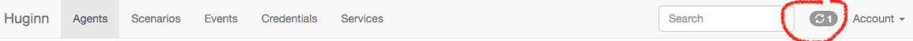

### Τεχνολογία Λογισμικού - Εργαστήριο


Έναρξη εργαστηρίου:

    Πέμπτη, 17/2/2021, 11:00πμ - εργαστήριο Γαληνός

---

##### Περιβάλλον εργασίας

Για την υλοποίηση των εργασιών του εργαστηρίου θα πρέπει να εργαστείτε σε ένα Unix/Linux terminal. Θα ξεκινήσουμε με ένα περιβάλλον εργασίας σε μια διαθέσιμη διανομή (πχ ubuntu) και αργότερα θα εργαστείτε στην εγκατάσταση ενός λειτουργικού από τον πηγαίο κωδικά του.  

Θα αξιοποιήσετε κάποιες από τις ήδη διαθέσιμες εντολές του shell, αλλά θα χρειαστεί να εγκαταστήσετε και κάποια νέα προγράμματα.

Θα εργαστείτε καθένας στο δικό του περιβάλλον εκτέλεσης και θα πρέπει να εξοικειωθείτε με τον τρόπο που σας εξυπηρετεί καλύτερα.
Απότερος σκοπός είναι να δουλέψετε σε ένα σύστημα linux χωρίς systemd, όπως αναφέρουν οι οδηγίες του μαθήματος (https://courses-ionio.github.io/projects/dokey/).
_Πριν όμως καταφέρετε να κάνετε αυτό_ μπορείτε να επιλέξετε μπορείτε να αξιοποιήσετε μία από τις πιο κάτω _use your own device_ επιλογές:
 * Αξιοποίηση ενός _reusable & disposable_ **linux docker container**, _οδηγίες πιο κάτω_
 * Ήδη εγκατεστημένο linux, πχ ως dual boot, όποια διανομή σας βολεύει/αρέσει
 * Εγκατάσταση ενός linux εντός virtual box
 * Χρήση _persistent live ubuntu usb_ (επιτρέπει την εκτέλεση XUbuntu Desktop περιβάλλοντος το οποίο διατηρεί τις αλλαγές που κάνετε, πχ εγκατάσταση προγραμμάτων)
   - Ακουλουθήστε [αυτές](https://www.howtogeek.com/howto/14912/create-a-persistent-bootable-ubuntu-usb-flash-drive/) τις οδηγίες και δημιουργήστε το δικό σας persistent live usb (αρκεί ένα usb flash drive 8GB, προτείνεται __USB3__)

   _linux = όποια διανομή σας βολεύει/αρέσει_

###### Οδηγίες αξιοποίησης docker container

Εγκαταστήστε στο συστημά σας το [docker](https://www.docker.com/).
* Ξεκινήστε ένα `container` βασισμένο πχ στο Ubuntu 20.04 `image`, μελετήστε [εδώ](https://www.docker.com/resources/what-container) τη διαφορά/σχέση images-containers:  
`docker run --name ionio-sw-lab-2022 -it -p 8080:4000 ubuntu:20.04`
    * Η παράμετρος `--name` ονοματίζει τον container ώστε να μπορούμε να το σταματήσουμε/ξεκινήσουμε εύκολα διατηρώντας της αλλαγές που κάνουμε
    * Η παράμετρος `-it` εξασφαλίζει ότι ο container, αφού δεν το ζητάμε να εκτελέσει κάποια εντολή ή πρόγραμμα, δεν θα τερματιστεί με την ολοκλήρωση της εντολής
    * Η παράμετρος `-p` κάνει port mapping από το 8080 του μηχανήματός μας στο 4000 εντός του νέου container... τώρα δε μας χρειάζεται, αλλά θα το βρούμε μπροστά μας ;-)
    * Η διανομή που ξεκινάμε είναι `ubuntu` έκδοση `20.04`
    * _Tip_ Εκτελέστε σε ένα άλλο terminal την εντολή `docker ps` για να επιβεβαιώσετε ότι ο container σας τρέχει, να δείτε το container id του και το όνομά του:
    ```
    CONTAINER ID        IMAGE               COMMAND             CREATED             STATUS              PORTS               NAMES
    16a2dc0d7c03        ubuntu:20.04        "/bin/bash"         About an hour ago   Up About an hour                        ionio-sw-lab-2022
    ```

* Λογικά είστε ήδη εντός του container `ionio-sw-lab-2022`, αν για κάποιο λόγο δεμ είστε, συνδεθείτε στον container σας για να ξεκινήσουμε να δουλεύουμε εντός αυτού.  
`docker attach ionio-sw-lab-2022`  
θα πρέπει να βρεθείτε εντός του container, σε ένα terminal και να μπορείτε να εκτελέσετε τυπικές εντολές bash:
```
root@16a2dc0d7c03:/# pwd
/
root@16a2dc0d7c03:/# whoami
root
```

* Ας δοκιμάσουμε να φτιάξουμε ένα φάκελο και ένα
αρχείο:  
```
root@16a2dc0d7c03:/# mkdir workspace
root@16a2dc0d7c03:/# touch workspace/hello    
root@16a2dc0d7c03:/# ls workspace/
hello
```

* Βγαίνουμε από τον container (και τον τερματίζουμε) με exit (ή Ctrl+D)
    * Αν τώρα εκτελέσετε `docker ps` **δεν** θα βλέπετε τον container σας, γιατί έχει σταματήσει. Εκτελέστε `docker ps -a` για να δείτε και τους σταματημένους containers:  
    ```
    CONTAINER ID        IMAGE               COMMAND             CREATED             STATUS                     PORTS               NAMES
    16a2dc0d7c03        ubuntu:20.04        "/bin/bash"         About an hour ago   Exited (0) 2 minutes ago                       ionio-sw-lab-2022
    ```

* Ξεκινάμε, πάλι:  
```docker start ionio-sw-lab-2022```  
και συνδεόμαστε στον container:  
```docker attach ionio-sw-lab-2022```  
ελέγχουμε αν οι αλλαγές μας έχουν διατηρηθεί:
```
root@16a2dc0d7c03:/# ls workspace/
hello
```

:fireworks: Έχουμε ένα persistent, reusable περιβάλλον (το οποίο εύκολα μπορούμε να ξαναδημιουργήσουμε εάν κάτι πάει στραβά!)

**ToDo (σας, <ins>για αυτή την εβδομάδα</ins>):**
1. Τροποποιήστε το prompt ώστε να δείχνει το ΑΜ σας _(hint: `PS1`;  αρχείο `/root/.bashrc`)_, πχ αλλαγή:  
```root@16a2dc0d7c03:```  
σε  
```Dr.DR  is root@16a2dc0d7c03:```  
    * Ελέγξτε εάν είναι persistent οι αλλαγές σας ;-)
2. Αν δεν έχετε ήδη (_πχ στο hci?_) δημιουργήστε (free) account στο [asciinema](https://asciinema.org/).
Χωρίς account οι καταγραφές που θα κάνετε κάνουν expire (σε ~15 ημέρες), άρα όταν έρθει η ώρα να αξιολογηθούν οι ασκήσεις σας.. _θα έχουν χαθεί_.  
Εγκαταστήστε το asciinema στο terminal περιβάλλον σας: `apt-get install asciinema` __και__ συνδέστε το terminal σας με το asciinema account σας με την εντολή `asciinema auth`.
    * Ελέγξτε το! Κάντε μια καταγραφή, ανεβάστε το στο asciinema, δοκιμάστε το url.
    * Μελετήστε τις οδηγίες του μαθήματος για τις προδιαγραφές των καταγραφών σας, πχ idle time!
3. Δημιουργία account στο github, με το ionio.gr e-mail σας.  
Fork το αποθετήριο του μαθηματος https://github.com/courses-ionio/sw.  
Κατέβασμα στο linux περιβάλλον σας. (Οδηγίες σύνδεσης linux+git+github [εδώ](https://kbroman.org/github_tutorial/pages/first_time.html) ή ακολουθήστε τα βασικά βήματα:)
    * Εγκαταστήστε το git στο περιβάλλον σας `apt-get install git`
    * Ρυθμίστε username και e-mail `git config --global user.name "Your name here"` και `git config --global user.email "...your_email...@ionio.gr"`
    * Προαιρετικά `git config --global color.ui true`
    * Δημιουργήστε ssh keys για διασύνδεση του περιβάλλοντος εργασίας σας με το github account σας.
        * Εκτελέστε `ssh-keygen -t rsa -C "...your_email...@ionio.gr"` (δώστε ένα password που δεν θα ξεχάσετε, αφήστε το προτεινόμενο folder/file)
        * Αντιγράψτε το __δημόσιο__ κλειδί σας `cat ~/.ssh/id_rsa.pub` και μεταβείτε στο github:
            * Στο https://github.com/settings/keys σας και προσθέστε ένα νέο ssh key σας.
        * Ελέγξτε τη σύνδεση terminal-github με την εντολή  
        `ssh -T git@github.com`
            * Θα σας ζητήσει να αποδεχτείτε το fingerptint του πιστοποιητικού του github, αν σε ό,τι prompt βλέπετε σε ένα υπολογιστή πατάτε yes, τότε απλά πατήστε yes, διαφορετικά ελέγξτε το fingerprint [εδώ](https://docs.github.com/en/github/authenticating-to-github/githubs-ssh-key-fingerprints).
            * Θα σας ζητήσει το password που δώσατε τέσσερα bullets πριν, δεν το ξεχάσατε (ήδη.. ελπίζω :-)
            * Περιμένετε/ελπίζετε να δείτε κάτι σαν
            ```
            Hi riggas-ionio! You've successfully authenticated, but GitHub does not provide shell access.
            ```
    * Clone το __forked__ repository στο linux συστημά σας
        * Δημιουργήστε ένα local folder για να κατέβει το repo  
        `mkdir /workspace/github`  
        και μετάβαση εκεί  
        `cd /workspace/github`  
        * Εκτέλεση `git clone git@github.com:_____repo____.git`
        * _... κάνετε edit/add/commit (ό,τι ζητά η πρώτη εβδομάδα) ..._
        * Ανέβασμα από το περιβάλλον εργασίας στο github `git push origin master`

---

##### CV

Για την εργασία cv θα πρέπει να αξιοποιήσουμε αρχικά το Jekyll (static site generator) και στη συνέχεια pandoc.  
Φυσικά (!) θα δουλέψουμε μέσα στο docker container που έχουμε ήδη φτιάξει.. οπότε κάντε τα δέοντα docker start και attach.  
Εντός του container πλέον:  
* Εγκατάσταση ruby, jekyll, κλπ προαπαιτούμενα, αναλυτικά [εδώ](https://jekyllrb.com/docs/installation/) <sub>...245+ΜΒ, θέλει χρόνο... :-( </sub>
    ```
    apt-get install ruby-full build-essential zlib1g-dev
    echo '# Install Ruby Gems to ~/gems' >> ~/.bashrc
    echo 'export GEM_HOME="$HOME/gems"' >> ~/.bashrc
    echo 'export PATH="$HOME/gems/bin:$PATH"' >> ~/.bashrc
    source ~/.bashrc
    gem install jekyll bundler
    ```
    * Test flight του jekyll, ας κάνουμε ένα δοκιμαστικό static web
    :-)
        * Ας φτιάξουμε ένα folder για το project μας  
        `mkdir /workspace/jekyll` και ας μεταβούμε σε αυτό  
        `cd /workspace/jekyll`
        * Αξιοποιούμε το bundler που εγκαταστήσαμε νωρίτερα `bundle init`
        * Προσθέτουμε το `gem "jekyll"` ως dependency στην τελευταία γραμμή του Gemfile που μόλις δημιουργήθηκε.  
        __Προσοχή:__ να μην ξεκινά και αυτή η γραμμή με # όπως η `# gem "rails"` γιατί τότε θα είναι σχόλιο!!
        * Εκτελούμε `bundler` και το project μας αποκτά όλα τα ruby gems που απαιτούνται
        * Ας δημιουργήσουμε το περιεχόμενό μας:
            * Πρώτα ένα folder για το περιεχόμενό μας `mkdir /workspace/jekyll/site`
            * Μετά το index.html αρχείο `vi site/index.html` με (ενδεικτικό) περιεχόμενο:  
            ```
            <!DOCTYPE html>
            <html>
              <head>
                <meta charset="utf-8">
                <title>Dr's Home</title>
              </head>
              <body>
                <h1>Hello World, this is the Dr!</h1>
              </body>
            </html>
            ```
        * Μέχρι εδώ δημιουργήσαμε την πρώτη ύλη του site μας, τώρα ας ζητήσουμε από το jekyll να δημιουργήσει το site μας.. (οκ, σε αυτό το site που δεν έχουν χρησιμιποιήσει templates, variables κλπ δεν θα  αλλάξει κάτι) `bundle exec jekyll build` και βλέπουμε κάτι σαν:  
        ```
        Configuration file: none
                Source: /workspace/jekyll
                Destination: /workspace/jekyll/_site
                Incremental build: disabled. Enable with --incremental
                Generating...
                    done in 0.01 seconds.
                Auto-regeneration: disabled. Use --watch to enable.
        ```
        * Ας δούμε το site μας... `jekyll serve --host 0.0.0.0 &`. Το site είναι διαθέσιμο στο `http://localhost:4000` (και σε κάθε άλλη ip που ακούει ο container αφού χρησιμοποιήσαμε το `--host 0.0.0.0`). Πώς θα το δούμε;
            * Από το terminal πχ με lynx. Εγκαθιστούμε `apt-get install lynx` - χρησιμοποιούμε `lynx localhost:4000/site`
            * Από το pc μας?
                * Το localhost του docker container __δεν__ είναι το localhost του μηχανήματός μας! Αλλά μπορούμε να κάνουμε port mapping από ένα port του μηχανήματός μας σε ένα port εντός του docker. Αυτό, βέβαια, κανονικά γίνεται κατά τη δημιουργία του container.. αλλά θα τα καταφέρουμε..  
                Πώς;
                    * Βγαίνουμε από τον container μας και τον τερματίζουμε:  
                    `docker stop __container_name__`
                    * Δημιουργούμε ένα image με βάση τον container μας:  
                    `docker commit __container_name__ __container_name__-img`
                    * Ξεκινάμε ένα __νέο__ container με βάση το image που μόλις δημιουργήσαμε __και__ port mapping από το 8080 του μηχανήματός μας στο 4000 εντός του νέου container:  
                    `docker run --name ionio-sw-lab2 -p 8080:4000 -it ionio-sw-lab-img`
                    * Πάμε στο folder `cd /workspace/jekyll/` και τρέχουμε πάλι το `jekyll serve --host 0.0.0.0 &`
                    * Πάμε σε ένα browser στο pc μας, δίνουμε διεύθυνση `http://0.0.0.0:8080/site/` και... βλέπουμε το site της μίας γραμμής που έχουμε φτιάξει ως εδώ.
        * Cleaning up.. έχουμε ένα άχρηστο πλέον container, το ionio-sw-lab της περασμένης εβδομάδας, αφού μόλις δημιουργήσαμε ένα κλώνο του με port mapping. Ας το ξεφορτωθούμε και ας αλλάξουμε όνομα στο νέο container μας.
            * Διαγραφή παλιού container `docker rm ionio-sw-lab`
            * Μετονομασία νέου `rename ionio-sw-lab2 ionio-sw-lab` (μπορεί να γίνει όσο τρέχει)

    * Τώρα ας ξεκινήσουμε να φτιάχνουμε ένα site που θα περιέχει το cv μας.
        * Νέο site.. = νέο folder για το project μας  
        `mkdir /workspace/cv` και ας μεταβούμε σε αυτό  
        `cd /workspace/cv`
        * Αρχικοποιούμε όπως πριν... _bundler κλπ_
        * Δημιουργούμε folder `mkdir /workspace/cv/site` και __διαχωρίζουμε μορφή από περιεχόμενο__:
            * Αρχείο view `vi /workspace/cv/site/index.html`, προσέξτε την αλλαγή με την προσθήκη δύο γραμμών `---` στην αρχή του αρχείου και `{{...}}` με ονόματα μεταβλητών:  
            ```
             ---
             ---
            <!DOCTYPE html>
            <html>
              <head>
                <meta charset="utf-8">
                <title>{{site.data.details.name}}'s Home</title>
              </head>
              <body>
                <h1>Hello World, this is the {{site.data.details.name}}!</h1>
              </body>
            </html>
            ```
            * Αρχείο data `vi /workspace/cv/_data/details.yml`, προσέξτε το αρχείο να ξεκινάει με μία γραμμή `---` και κάθε _μεταβλητή_ που θέλουμε να είναι διαθέσιμη στο παραγώμενο html να είναι _κλειδί_ στο yml αρχείο:
                * btw.. λίγα λόγια για το [YAML](https://www.cloudbees.com/blog/yaml-tutorial-everything-you-need-get-started/)

            ```
             ---
            # Personal details
            name: Friedrich Nietzsche
            urls:
             - wki.pe/friedrich_nietzsche
             - twitter.com/tinynietzsche
            ```
            * Τρέχουμε το `jekyll serve --host 0.0.0.0 &` (αν τρέχει κάποιο άλλο jekyll, κάντε το kill) ελέγχουμε και... βλέπουμε ένα site στο οποίο τα δεδομένα διαχωρίζονται από την εμφάνιση!
            * Αλλάζουμε το index.html αρχείο για να δείχνει και τα url με ένα for loop:
            ```
             ---
             ---
            <!DOCTYPE html>
            <html>
              <head>
                <meta charset="utf-8">
                <title>{{site.data.details.name}}'s Home</title>
              </head>
              <body>
                <h1>Hello World, this is the {{site.data.details.name}}!</h1>
                <p>Reach me at:
                <ul>
                  
                    <li><a href="http://{{url}}">{{url}}</a></li>
                  
                </ul>
              </body>
            </html>
            ```
            * :-) τέλεια!  

    * Τελειώσαμε;.. όχι, αρχίζουμε!   

        * Ας δημιουργήσουμε ένα νέο repository, έστω `cv-1`, public repository με ένα README.md.
        * Στο github κάνουμε τις ρυθμίσεις `Settings` > βασική σελίδα, πολύ χαμηλά `GitHub Pages`.
            * Source branch το __master__ και folder το __/__ (root)
            * Αφήνουμε να προσθέσει sample περιεχόμενο README.md αρχείο
                * Τώρα κάθε φορά που θα κάνουμε ένα commit, θα τρέχει το jekyll και ό,τι παράγεται θα πηγαίνει στο github pages ως rendered html site.
        * Αφήνουμε το github repo ως έχει και πάμε πίσω στο container μας.
            * Πάμε στο `cd /workspace/github` και yet another jekyll site: `mkdir cv`, `cd cv`.
        * Αξιοποιούμε το bundler που εγκαταστήσαμε νωρίτερα `bundle init`
        * Προσθέτουμε στο τέλος του Gemfile που μόλις δημιουργήθηκε:
            ```
            gem "jekyll", "~> 3.9.0"
            gem "github-pages","~> 212" , group: :jekyll_plugins
            group :jekyll_plugins do
              gem "jekyll-feed", "~> 0.15.1"
            end
            ```
            Προσοχή συμβουλευόμαστε το github gem dependencies [εδώ](https://pages.github.com/versions/)!
        * Εκτελούμε `bundler` και το project μας αποκτά όλα τα ruby gems που απαιτούνται
        * Κόβουμε δρόμο και φέρνουμε σε αυτό το project τα:
            * `cp -r /workspace/cv/_data/ .`
            * `cp /workspace/cv/site/index.html .`
        * _Για να μην αντιμετωπίσουμε πρόβλημα με την κωδικοποίηση χαρακτήρων.._
            * `apt-get install -y locales`
            * `echo "en_US UTF-8" > /etc/locale.gen`
            * `locale-gen en_US.UTF-8`
            * `export LANG=en_US.UTF-8`
            * `export LANGUAGE=en_US:en`
            * `export LC_ALL=en_US.UTF-8`
                * _τα τρία τελευταία προσθέστε τα στο τέλος του `/root/.bashrc`_
        * **upd.** Αν θέλουμε υποστήριξη σε ελληνικά (πχ στο vim)
            * Εκτέλεση
            ```
            echo "el_GR UTF-8" > /etc/locale.gen
            locale-gen el_GR.UTF-8         
            ```
            * Προσθήκη στο `/root/.bashrc` και source το ίδιο αρχείο για να ξαναφορτωθεί
            ```
            export LANG="el_GR.UTF-8"
            export LC_CTYPE="el_GR.UTF-8"
            export LC_NUMERIC="el_GR.UTF-8"
            export LC_TIME="el_GR.UTF-8"
            export LC_COLLATE="el_GR.UTF-8"
            export LC_MONETARY="el_GR.UTF-8"
            export LC_MESSAGES="el_GR.UTF-8"
            export LC_PAPER="el_GR.UTF-8"
            export LC_NAME="el_GR.UTF-8"
            export LC_ADDRESS="el_GR.UTF-8"
            export LC_TELEPHONE="el_GR.UTF-8"
            export LC_MEASUREMENT="el_GR.UTF-8"
            export LC_IDENTIFICATION="el_GR.UTF-8"
            export LANG=el_GR.UTF-8
            export LC_ALL=el_GR.UTF-8
            ```
        * Σύνδεση με github repository  
            * `git init`
            * `git remote add origin git@github.com:riggas-ionio/cv-1.git`
            * `git add index.html`
            * `git add _data/`            
        * Είμαστε έτοιμοι για `bundle exec jekyll build`
        * Και.. `bundle exec jekyll serve --host 0.0.0.0 &`
            * Test σε browser..! ;-)
                * http://localhost:8080/ δείχνει σωστά
                * https://riggas-ionio.github.io/cv-1/ ... όχι... 8-(  
                γιατί το πρώτο το βλέπουμε από το jekyll εντός του container, δεν έχει ανέβει ακόμη στο github ώστε να γίνει build και να σταλεί στο github pages.  
                Άρα..
        * Commit και push..
            * `git commit -m "Ιnitial CV commit"`
            * `git push -u origin master`  
            Με το push στο __github.com__ το site γινεται _build_ και ανεβαίνει και στο __github.io__ (Github Pages)!

**ToDo (σας, <ins>για αυτή την εβδομάδα</ins>):**
1. Δείτε ένα πιο πλήρες yml για CV [εδώ](https://github.com/mrzool/cv-boilerplate)  
2. Συμπληρώστε τα στοιχεία σας (ή τέλος πάντων αρκετά) στο `_data/details.yml` και δημιουργήστε το κατάλληλο `index.html` για την προβολή τους.
    * Τσεκάρετε τακτικά locally, όταν είστε ικανοποιημένοι ανεβάστε στο github με push
3. Φροντίστε για έχετε καταγράψει στο asciinema τη δουλεία σας
4. Κάντε commit την πρόοδό σας

---

##### CV + Netlify

Έχουμε ήδη αξιοποιήσει τις δυνατότητες που παρέχουν τα Github & Jekyll για continuous deployment σε Github pages.  
Τώρα θα αξιοποιήσουμε και τις δυνατότητες που παρέχει το [Netlify](https://www.netlify.com/) για serverless δημοσιοποίηση διαδικτυακού περιεχομένου.  

* Κάνετε εγγραφή στο [Netlify](https://www.netlify.com/) και ένα νέο site βασισμένο σε ένα [Git repository](https://www.netlify.com/blog/2015/10/28/a-step-by-step-guide-jekyll-3.0-on-netlify/).
    * Επιλέξτε ως Git provider το Github και (αναγκαστικά) δώστε τις εξουσιοδοτήσεις που ζητά - προσπαθήστε να δώσετε όσο λιγότερη πρόσβαση μπορείτε, πχ μόνο στο repo που θέλετε να φιλοξενήσετε στο Netlify.
    * Επιλέξτε το **repository** που θέλετε να προσθέσετε και ποιο **branch** περιέχει τον κώδικα που θα κάνετε deploy.  
    __N.B.:__ σε αυτό το branch θα πρέπει να κάνετε commit/push ώστε οι αλλαγές να κάνουν trigger το νέο deployment.
    * Δεδομένου ότι είναι jekyll based το site μας, δώστε τα κατάλληλα [basic build settings](https://docs.netlify.com/configure-builds/common-configurations/#jekyll):
        * Build command: `jekyll build`
        * Publish directory: `_site`  


:-) Τέλος... _καλό;_        
:-/ μπα..

* Μια συλλογή από σφάλματα που ίσως εμγανίζονται στο deploy log: (´･_･`)
    * Το Netlify δεν βρίσκει το jekyll...  
    * `GitHub Metadata: Error processing value 'title':`


* Επιβεβαιώστε ότι:
    * Στο github repository έχετε περιλάβει τα αρχεία `Gemfile` και `Gemfile.lock` που έχετε δημιουργήσει για να _βλέπετε_ τοπικά το jekyll based cv σας. Στο github αυτά δεν ήταν απαραίτητα, αφού ουσιαστικά τα είχαμε δημιουργήσει τοπικά για να κάνουμε replicate το setup του github/pages, τώρα είναι απαραίτητα στο Netlify, άρα κάνετε τα git add/commit/push.
    * Στο github repository έχετε περιλάβει ενα _config.yml αρχείο, πρόκειται για jekyll config file το οποίο στο github (πάλι) δεν ήταν απαραίτητο, αλλά για το Netlify χρειάζεται. Τα ελάχιστα δεδομένα που πρέπει να περιέχει είναι τιμή για το όνομα του `repository` που συνδέετε με το Netlify

Σε κάθε push που κάνετε στο github γίνεται πλέον αυτόματα trigger ένα deploy στο githib pages και ένα ακόμη στο Netlify.  
🌍🔋__Think before you push__ (to the repo)! Test locally! Αν όχι για άλλο λόγο, γιατί το free account του Netlify σας δίνει 300 build minutes/month,

**ToDo (σας, <ins>για αυτή την εβδομάδα</ins>):**  
* Εξερευνήστε περισσότερο το Netlify, πχ χαρίστε ένα πιο κομψό url στο site σας.

---

##### CV 2 PDF

Μπορείτε αν αξιοποιήσετε pandoc για μετατροπή yml + html template σε latex και στη συνέχεια να μετατρέψετε το latex σε pdf με κάποιο template.

Εδώ θα αξιοποιήσουμε την python βιβλιοθήκη weasyprint.org

* Για να εγκαταστήσουμε weasyprint χρειαζόμαστε.. μερικά προαπαιτούμενα:
`apt update` και στη συνέχεια  
`apt-get install build-essential python3-dev python3-pip python3-setuptools python3-wheel python3-cffi libcairo2 libpango-1.0-0 libpangocairo-1.0-0 libgdk-pixbuf2.0-0 libffi-dev shared-mime-info`
* Εγκατάσταση weasyprint μέσω pip:
`pip3 install weasyprint`

* _Όσο το jekyll τρέχει_ μπορούμε να ζητήσουμε από το weasyprint να μετατρέψει ό,τι βλέπουμε στο http://localhost:4000 σε pdf. Πώς;
    * Εντός του `/workspace/github/cv-1`, δημιουργούμε ένα folder για το pdf cv μας `mkdir pdf`
    * Στη συνέχεια εκεί εκτελούμε `weasyprint http://localhost:4000/ pdf/cv.pdf`
        * Ελέγχουμε το αποτέλεσμα μέσα από ένα browser στο host μηχάνημά μας.. :-)
    * Τροποποιούμε το `index.html` αρχείο ώστε να έχει ένα link προς το pdf cv μας.

* Πώς μπορούμε να καθορίσουμε την print version εμφάνιση του cv μας;
    * Το weasyprint μπορεί να λάβει παράμετρο ένα css με _οδηγίες_ για το styling της print version του cv
    * Δημιουργούμε το `_template/pdf.css` με ενδεικτικό περιεχόμενο:
    ```
    @page {
      margin: 0cm; /* Set margin on each page */
      padding: 1cm; /* Set padding on each page */
    }
    ```  
    και εκτελούμε  
    `weasyprint http://localhost:4000/ pdf/cv.pdf -s _template/pdf.css`
        * Η εμφάνιση του παραγώμενου pdf άλλαξε! Βεβλιτώστε ακόμη περισσότερο: https://weasyprint.readthedocs.io/en/stable/tutorial.html


* Πώς όμως μπορούμε να αυτοματοποιήσουμε τη διαδικασία; Δλδ κάθε φορά που κάνουμε μια αλλαγή στο index.html ή στο details.yml και κάνουμε commit το pdf να δημιουργείται αυτόματα;
    * Git [hooks](https://www.atlassian.com/git/tutorials/git-hooks)
        * Συνδυάστε [αυτό](https://stackoverflow.com/questions/30376741/run-script-before-commit-and-include-the-update-in-this-commit) και [αυτό](https://stackoverflow.com/questions/3284292/can-a-git-hook-automatically-add-files-to-the-commit/12802592#12802592).

* To link που εμφανίζεται στο pdf είναι σωστό;
    * Πώς μπορείτε να το αποφύγετε αυτό;
        * Δοκιμάστε κάτι [τέτοιο](https://www.w3schools.com/css/css3_mediaqueries.asp).
        * ή αξιοποιήστε το `_template/pdf.css` για να κρύψετε το link.

---

##### GIT COMMIT/MQTT 2 Slack

Αποκτήστε ένα free account στο [Slack](https://slack.com/) και δημιουργήστε ένα workspace.
* Εντός του workspace δημιουργήστε ένα νέο channel, έστω `sw-notifications`.
* Σε ένα browser μεταβείτε στο https://api.slack.com/apps και επιλέξτε `Create New App`.
    * Δώστε ένα όνομα, πχ `my-sw-notif-app` και διαλέξτε το workspace στο οποίο αυτό το app θα κοινοποιεί.
    * Το app πρέπει να δημιουργήθηκε, από τις επιλογές που έχετε στο ui διαλέξτε  
    ```
    Incoming Webhooks
    Post messages from external sources into Slack.
    ```
    και εκεί κάνετε toggle το `Activate Incoming Webhooks`.  
    Στο τέλος της σελίδας διαλέξτε `Add New Webhook to Workspace` και επιλέξτε σε ποιο channel να γίνεται η αποστολή των μηνυμάτων, πχ `notifications`.
    Αφήστε τη σελίδα να περιμένει, παρατηρήστε ότι σας προβάλει ένα παράδειγμα curl post προς το channel σας (έχουν κρυφτεί τα keys):  
    ```
    curl -X POST -H 'Content-type: application/json' --data '{"text":"Hello, World!"}' https://hooks.slack.com/services/____/____/____
    ```

Εντός του container που δουλεύουμε όλες αυτές τις εβδομάδες...
* Εγκαταστήστε το `curl` για να κάνουμε μια πρώτη δοκιμή.  
`apt install curl`
* Στη συνέχεια δοκιμάστε να κάλεσετε το curl όπως δείχνει η πιο πάνω εντολή, αλλά με το slack url που αντιστοιχεί στο δικό σας workspace/channel.
    * Αν όλα έγιναν σωστά, πρέπει στο slack να λάβατε ένα _Hello, World_ μήνυμα από την εφαρμογή σας :-)
* Μεταβείτε εντός του folder που δουλέυουμε το cv (`cd /workspace/github/cv-1/`).
* Εκτελέστε εκεί  
```
hash=$(git rev-parse --short HEAD)
msg=$(git log -1 --pretty=%B)
curl -X POST -H 'Content-type: application/json' --data '{"text":"Last CV commit ('$hash'): '"$msg"'"}' https://hooks.slack.com/services/___/___/___
```
* Προσθέστε τον κώδικα στο hook της περασμένης εβδομάδας.
* Επιπλέον, Χρησιμοποιήστε το κώδικα:  
```
if ! lsof -i:4000
then
  echo Starting Jekyll
  bundle exec jekyll serve --host 0.0.0.0 &
else
  echo Jekyll running on 4000
fi
```
για να ελέγξετε αν το Jekyll ήδη τρέχει.
* Κάντε κάποια αλλαγή σε ένα αρχείο του repo σας και με το commit θα πρέπει να λάβετε ένα μήνυμα στο slack.

Ας δουλέψουμε με ένα mqtt broker.
* Εγκαταστήστε το [mosquitto](https://mosquitto.org/): `apt-get install mosquitto`
    * Τρέχει;... δοκιμάστε: `/etc/init.d/mosquitto status`, αν το αποτέλεσμα είναι ` * mosquitto is not running` ελέγξτε το logging που έγινε κατά την εγκατάσταση.
    Αν αναφέρει `invoke-rc.d: policy-rc.d denied execution of start.` τότε:  
    ```
    printf '#!/bin/sh\nexit 0' > /usr/sbin/policy-rc.d
    /etc/init.d/mosquitto start
    /etc/init.d/mosquitto status
    ```
    και το πρόβλημα πρέπει να λύθηκε, αν όχι _google it!_
* Εγκαταστήστε και αντίστοιχους clients: `apt-get install mosquitto-clients`
    * Δοκιμάστε... `mosquitto_sub -t "notifications" &`
    και.. `mosquitto_pub -m "Hello World from mosquitto_pub client" -t "notifications"`  
    Εμφανίστηκε το μήνυμα;

* Εγκαταστήστε το mqttwarn:
    ```
    pip3 install --upgrade
    pip3 install mqttwarn
    ```
    * Δημιουργήστε και μεταβείτε σε ένα φάκελο `/workspace/mqttwarn`
    * Ακολουθήστε τα βήματα του configuration που περιγράφονται:  
    ```
    # Create configuration file
    mqttwarn make-config > mqttwarn.ini

    # Create file for custom functions
    mqttwarn make-samplefuncs > samplefuncs.py
    ```
    * Προσθέστε το config τις απαραίτητες ρυθμίσεις για το [http](https://github.com/jpmens/mqttwarn/blob/master/HANDBOOK.md#http).
        * Τροποποιήστε κατάλληλα το post action ώστε να κάνει post στο url του slack api endpoint σας.  
        Σημεία στο αρχείο init που χρειάζεται να παρέμβετε είναι τα:
        ```
        ; name the service providers you will be using.
        launch    = file, log, http

        ; -------
        ; Targets
        ; -------

        [config:http]
        timeout = 60
        targets = {
                        #method     #URL               # query params or None                              # list auth # Json
          'notifications'    : [ "post", "https://hooks.slack.com/services/___/___/___", None, True ]
          }

        ; ------------------------------------------
        ;                  Basic
        ; ------------------------------------------

        [hello/1]
        ; echo '{"name": "temperature", "number": 42.42}' | mosquitto_pub -h localhost -t hello/1 -l
        targets = log:info
        format = u'{name}: {number} => {_dthhmm}'

        [notifications]
        targets = http
        ```        
    * Ίσως χρειαστεί λίγο debugging ο κώδικας του http module :-)  
    Αν παρατηρήσετε τα logging νημύματα του mqttwarn προκύπτει σφάλμα κατά την εκτέλεση του αρχείο `/usr/local/lib/python3.8/dist-packages/mqttwarn/services/http.py`: ***'Request' object has no attribute 'add_data'***.  
    Κάνετε edit το αρχείο τροποποιώντας τη γραμμή:  
    `#request.add_data(encoded_params)` σε  
    `request.data = bytes(encoded_params, 'utf-8')`
    Αν κάνετε publish στο mosquitto ένα json το οποίο αποδέχεται το slack, θα πρέπει να δείτε το μήνυμά σας στο slack.  
    Αν το μήνυμα δεν είναι κατάλληλα μορφοποιημένο για το slack, θα βλέπετε στο mqttwarn log ***HTTP Error 400: Bad Request***    
    * :fireworks: Αφού δεν υπάρχει module για το slack api (που να δουλεύει με webhook)... γιατί δε φτιάχνετε ένα; _λίγη αλλαγή το module http απαιτείται μόνο!_  
    :fireworks: :fireworks: Αφού το φτιάξετε, γιατί δεν το ανεβάζετε και στο github! Κάντε και ένα pull request στο mqttwarn και ίσως γίνετε μέρος του δημόσιου ανοιχτού λογισμικού! :-)

---

##### HUGINN Agents

Αν έχετε δοκιμάσει το [IFTTT](https://ifttt.com/) θα έχετε καταλάβει ότι είναι _ανάγκη_ ορισμένα tasks να εκτελούνται μόνα τους και _(μόνο)_ όταν κάτι ενδιαφέρον υπάρχει να ενημερώνεστε.  
Το Huginn είναι ένα free και open source περιβάλλον στο οποίο μπορείτε να προγραμματίσετε την εκτέλεση _tasks_ από ένα σύνολο από διαθέσιμους agents.  
[read the docs](https://github.com/huginn/huginn) | [view introductory screencast](http://vimeo.com/61976251)

Πάμε:...
* Πρώτη προσπάθεια με ένα έτοιμο στημένο huginn docker image.
    * Σε ένα terminal (_εκτός του container που παιδεύουμε_): `docker run -it -p 3000:3000 --name ionio-sw-lab-huginn huginn/huginn`
    * Δοκιμάστε σε ένα browser (στο host, όχι σε κάποιο container): http://localhost:3000/
        * Credentials: admin | password
    * Ok,.. τώρα really, [read the docs](https://github.com/huginn/huginn)!
    * Hands-on test:
        * Μεταβείτε στο Agents και προσθέστε δύο (χαμηλά, κουμπί **+ New Agent**):
            * Πρώτα προσθέστε ένα Agent τύπου `Website Agent`: scrapes a website, XML document, or JSON feed and creates Events based on the results.  
                * **Type**: `Website Agent`
                * **Name**: `Ionio news feed scrapper`
                * **Schedule**: `Every 10μ` ***! Υπερβολικό, απλά για να δούμε την εκτέλεση του Agent! Αυξήστε την περίοδο για οποιοδήποτε άλλο (όχι testing) σύστημα***
                * **Keep events**: `7 days`
                * **Options**:
                ```
                {
                  "expected_update_period_in_days": "2",
                  "url": "https://ionio.gr/gr/news/all-news-f1-all-f2-all/",
                  "type": "html",
                  "mode": "on_change",
                  "extract": {
                    "url": {
                      "xpath": "//*[@class=\"news-list-block\"]/a/@href",
                      "value": "."
                    },
                    "title": {
                      "xpath": "//*[@class=\"news-list-block\"]/a",
                      "value": "normalize-space(.)"
                    }
                  }
                }
                ```
                Δοκιμάστε τη λειτουργία του Agent με εκτέλεση `Dry Run`. Αν όλα είναι σωστά, πρέπει να πήρατε απόκριση, σαν:  
                ```
                [
                  {
                    "url": "https://ionio.gr/gr/news/20465",
                    "title": "ΒΥΡΩΝ: Η Ελληνική Επανάσταση «ζωντανεύει» με ένα παιχνίδι!"
                  },
                  {
                    "url": "https://ionio.gr/gr/news/20464",
                    "title": "Μνημόνιο συνεργασίας μεταξύ του Ιονίου Πανεπιστημίου και του Συνδέσμου Ημερήσιων Περιφερειακών Εφημερίδων"
                  },
                  ...
                  {
                    "url": "https://ionio.gr/gr/news/20212",
                    "title": "Μελέτη και κατασκευή κτηρίου για τη στέγαση του Τμήματος Περιφερειακής Ανάπτυξης του Ιονίου Πανεπιστημίου στη Λευκάδα"
                  }
                ]
                ```
                Αυτά είναι τα events που θα παράγει αυτός ο Agent. Ας μελετήσουμε λίγο τι έγινε και πώς.

                * Αποθηκεύουμε τον Agent
                * Στη σελίδα `Agents` επιλέγουμε από το μενού (στη γραμμή του _Ionio news feed scrapper_) την επιλογή `Run` ώστε να εκτελεστεί ο Agent άμεσα.
                * Περιοδικά, όταν τρέχει κάποιος Agent, εμφανίζεται ένα εικονίδιο, πάνω δεξιά στο toolbar:  
                  
                Κλικ σε αυτό ή απλά μεταβείτε στο url <host:port>/jobs.
                * Επιπλέον δείτε τα events που έχουν παραχθεί από το μενού `Events`.  
                Είναι όλα τα ζεύγη url - title από τα news που αντλήθηκαν από το https://ionio.gr/gr/news/all-news-f1-all-f2-all/.
                * Στη λίστα των Agents, κλικ στον Agent `Ionio news feed scrapper` και μελετήστε τα `Details` του, τα `Events` που έχει παράγει, τα `Logs` εκτέλεσής του.
                Περιοδικά ο Agent τρέχει πάλι, αλλά όσο δεν αλλάζει το περιεχόμενο της https://ionio.gr/gr/news/all-news-f1-all-f2-all/ δεν παράγονται νέα events.

            * Στη συνέχεια προσθέστε ένα Agent τύπου `Post Agent`: receives events from other agents (or runs periodically), merges those events with the Liquid-interpolated contents of payload, and sends the results as POST (or GET) requests to a specified url.
                * **Type**: `Post Agent`
                * **Name**: `POST to slack`
                * **Schedule**: `Every 10μ` ***! Αυτό δεν είναι υπερβολικό, αν πρόκειται να λαμβάνουμε notifications, ας είναι αυτά συχνά..***
                * **Keep events**: `7 days`
                * **Sources**: `Ionio news feed scrapper`  ***! Αυτό είναι η είσοδος αυτού του Agent.***
                * **Options**:
                ```
                {
                  "post_url": "https://hooks.slack.com/services/___/___/___",
                  "expected_receive_period_in_days": "1",
                  "content_type": "json",
                  "method": "post",
                  "headers": {
                    "Content-type": "application/json"
                  },
                  "payload": {
                    "text": "{{ title }}; more on {{url}}"
                  },
                  "emit_events": "false",
                  "no_merge": "false",
                  "output_mode": "clean"
                }
                ```
                _Χρησιμοποιήστε το slack hook της περασμένης εβδομάδας._  
                Δοκιμάστε τη λειτουργία του Agent με εκτέλεση `Dry Run`. Στο dry run, προσθέστε (απλά κλικ) ένα από τα events που εμφανίζονται για να χρησιμοποιηθεί ως demo data.  
                Αν όλα είναι σωστά, πρέπει να πήρατε απόκριση, σαν (στο huginn):  
                ```
                [00:00:00] INFO -- : Dry Run started
                [00:00:00] INFO -- : Dry Run finished
                ```
                και να λάβατε ένα notification στο slack.

                * Αποθηκεύουμε τον Agent
                * Αν πάμε στον Agent `Ionio news feed scrapper` και εκτελέσουμε `Re-emit all events`, τότε αυτά τα events θα φτάσουν στον Agent `POST to slack` και από εκεί στο slack channel σας.

        * Μεταβείτε στη σελίδα /diagram για να δείτε το γράφο των Agents που χρησιμοποιείτε.

    * Μελετήστε τα διαθέσιμα Agents, βρίσκονται στο φάκελο `huginn/app/models/agents/post_agent.rb`

**ToDo (σας, <ins>για αυτή την εβδομάδα</ins>):**  
* Εξερευνήστε περισσότερο το Haginn, δοκιμάστε agents όπως:
    * Website Agent για να λαμβάνετε μέσω API τον καιρό σε κάποια τοποθεσία.
        * Χρησιμοποιήστε το openweathermap.org
            * _Fetch hourly forecast for 48 hours for Corfu_:  
            API call  
            https://api.openweathermap.org/data/2.5/onecall?lat=39.666664&lon=19.749997&appid=YOURAPIID
    * SlackAgent, για να μη χρειάζεται να κάνουμε απλά HTTP POST στο slack.
        * Χρησιμοποιήστε [Liquid filters](https://shopify.dev/docs/themes/liquid/reference/filters) για να μορφοποιήσετε το μήνυμα που θα στείλετε στο slack.  
        Πχ. το  
        ```
        {"dt":1616698800,"temp":281.95,"weather":"Clear"}
        ```
        σε
        ```
        Thu, Mar 25, 2021 - 12:00 :: Clear, temp=9.8oC
        ```
---

##### NTFY (see legacy/2020)

---

##### JRNL.SH

Εντός του container που δουλεύουμε όλες αυτές τις εβδομάδες...
* Δημιουργήστε ένα φάκελο `/workspace/journal`, δουλεύουμε σε αυτόν.
* Εγκαθιστούμε:
```
pip3 install jrnl
```
* Χρησιμοποιούμε!:
```
jrnl yesterday: Thinking what to do on SW lab. Mix lots of scripts!
Path to your journal file (leave blank for /root/.local/share/jrnl/journal.txt): /workspace/journal/journal.txt
Do you want to encrypt your journal? You can always change this later [y/N] N
[Journal 'default' created at /workspace/journal/journal.txt]
[Entry added to default journal]
```
* Ας δούμε τι περιέχει αυτό το αρχείο:
`less journal.txt `
```
[2021-04-14 09:00] Thinking what to do on SW lab.
Mix lots of scripts!
journal.txt (END)
```
:fireworks: Είναι ένα απλό text αρχείο. Και όλοι ξέτουν ότι Text + Git = :heart:

* _Minor hack, ας βλέπουμε σε ποιο branch ειμαστε_ `vi  /root/.bashrc` και προσθήκη:
    ```
    parse_git_branch() {
         git branch 2> /dev/null | sed -e '/^[^*]/d' -e 's/* \(.*\)/(\1)/'
    }
    export PS1="\u@\h \[\e[32m\]\w \[\e[91m\]\$(parse_git_branch)\[\e[00m\]$ "
    ```

* Ας οργαγώσουμε τον επαγγελματικό μας χρόνο:
    ```
    git checkout -b work_journal
    Switched to a new branch 'work_journal'
    rm journal.txt
    touch journal.txt
    less journal.txt
    ```
    Και τώρα ας προσθέσουμε μερικά journal entries:
    ```
    jrnl yesterday: Kicked off new project. This project will not only make me wealthy, it will make me famous too. Could lead to a Turing Award.
    [Entry added to default journal]
    jrnl today: Project backlog is huge already. I might need a partner, I wonder can we split the Award?
    [Entry added to default journal]
    ```
    Ας δούμε τι γίνεται στο journal μας `jrnl -to now`.
    ```
    git add .
    git commit -m "Work journal"
    ```

* Ας οργαγώσουμε τον προσωπικό μας χρόνο:
    ```
    git checkout master
    git checkout -b personal_journal
    Switched to a new branch 'personal_journal'
    rm journal.txt
    touch journal.txt
    less journal.txt
    ```
    Και τώρα ας προσθέσουμε μερικά journal entries:
    ```
    jrnl yesterday: Found out about a great journal terminal app. I will start using it!
    [Entry added to default journal]
    jrnl today: Loving the journal app already. All I now need is content! THINK!
    [Entry added to default journal]
    ```
    Ας δούμε τι γίνεται στο journal μας `jrnl -to now`.
    ```
    git add .
    git commit -m "Personal journal entries"
    ```

* Και τώρα git magic!
    * Αναζήτηση σε όλα τα journals: `git branch | cut -c3- | xargs git grep "I"`
    Αποτελέσματα σε όλα τα branches:
    ```
    personal_journal:journal.txt:I will start using it!
    personal_journal:journal.txt:All I now need is content! THINK!
    work_journal:journal.txt:I might need a partner, I wonder can we split the Award?
    ```

**ToDo (σας, <ins>για αυτή την εβδομάδα</ins>):**  
* Εξερευνήστε περισσότερο τις δυνατότητες του jrnl μαζί με το git. Πχ δημιουργήστε ένα shared github repo και μοιραστείτε με κάποιον άλλο το work_journal σας αλλά κρατήστε ιδιωτικό το personal_journal.
